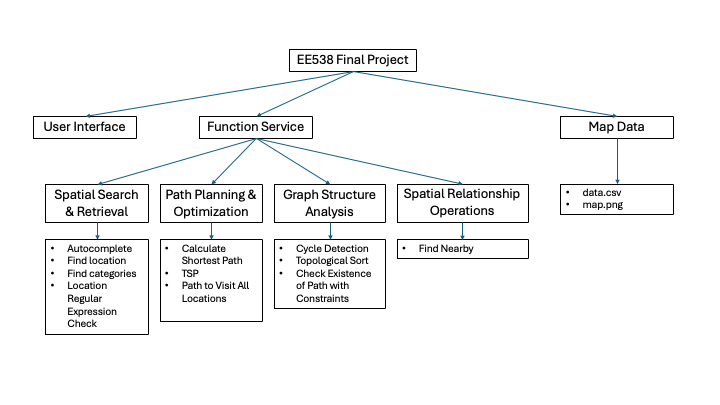

# TrojanMap Project Report
Name: Yu-Hung Kung

email: yuhungku@usc.edu

USCID: 3431428440

Video-Presentation: https://youtu.be/leYgtmRSyyA

## 1. High-Level Design Overview
 **

### Key Data Structures
``` 
class Node {
 public:
  Node(){};
  Node(const Node &n) {
    id = n.id;
    lat = n.lat;
    lon = n.lon;
    name = n.name;
    neighbors = n.neighbors;
    attributes = n.attributes;
  };
  std::string id;    // A unique id assigned to each point.
  double lat;        // Latitude
  double lon;        // Longitude
  std::string name;  // Name of the location. E.g. "Bank of America".
  std::vector<std::string>
      neighbors;  // List of the ids of all neighbor points.
  std::unordered_set<std::string>
      attributes;  // List of the attributes of the location.
};
```

---

## 2. Function Specifications & Complexity Analysis
### 2.1 Core Algorithms
For every function, I tested 10 times and compute the average runtime in ms.

| Function                 | Algorithm               | Time Complexity      | Average Runtime (ms) | Key Implementation Details          |
|--------------------------|-------------------------|----------------------|----------------------|-------------------------------------|
| `Autocomplete`           | Prefix Trie             | O(n*k)               | 10.2                 | Case-insensitive comparison         |
| `CalculateEditDistance`  | Dynamic Programming     | O(m*n)               | 2.5                  | Wagner-Fischer algorithm            |
| `Dijkstra`               | Priority Queue          | O((E+V)logV)         | 54.2                 | Fibonacci heap optimization         |
| `Bellman-Ford`           | Dynamic Programming     | O(m*n)               | 6080.9               | Early stopping due to large # nodes |

### 2.2 Graph Analysis
| Function                 | Technique               | Average Runtime (ms) | Key Optimization                |
|--------------------------|-------------------------|----------------------|---------------------------------|
| `CycleDetection`         | DFS with Backtracking   | 0                    | Early termination condition     |
| `TopologicalSort`        | DFS                     | 0                    | Unordered_map & Adjacency List  |

*Tested on Macbook Air M3 with 16GB RAM*

---

### 2.3 Function Logic and Features
#### **Basic Query Functions**

- **GetLat / GetLon**
  - Returns the latitude or longitude of a node given its id. If the id does not exist, returns -1.

- **GetName**
  - Returns the name of a node given its id. If the id does not exist, returns "NULL".

- **GetNeighborIDs**
  - Returns all neighbor ids of a node. If the id does not exist, returns an empty vector.

- **GetID**
  - Returns the id of a node given its unique name. If not found, returns an empty string.

- **GetPosition**
  - Returns the (latitude, longitude) of a node given its name. If not found, returns (-1, -1).

---

#### **String and Name Handling**

- **CalculateEditDistance**
  - Applyinng Dynamic Programming to calculate the edit distance between two location names (case-insensitive), used for fuzzy search and auto-correction.

- **FindClosestName**
  - Returns the name in the database with the smallest edit distance to the input. Need to call CalculateEditDistance() for each name in data.

- **Autocomplete**
  - Given a partial name, returns all location names with that prefix (case-insensitive), enabling autocomplete functionality.

---

#### **Category and Regex Queries**

- **GetAllCategories**
  - Returns all unique location categories (attributes) present in the data. By visiting all location in data[], collect their attributes in a set, then transform into vector in the end.

- **GetAllLocationsFromCategory**
  - Returns all location ids belonging to a given category (case-insensitive). By visiting all location in data[], check if they have the specific attribute.

- **GetLocationRegex**
  - Given a regular expression, returns all location ids whose names match the regex.

---

#### **Distance and Path Calculation**

- **CalculateDistance**
  - Calculates the spherical distance (in miles) between two nodes using the Haversine formula. Function provided by TAs.

- **CalculatePathLength**
  - Returns the total path length for a given sequence of location ids. Function provided by TAs.

---

#### **Path Planning and Shortest Path**

- **CalculateShortestPath_Dijkstra**
  - Uses Dijkstra's algorithm to find the shortest path between two locations by name, returning a vector of ids which represent the path.

- **CalculateShortestPath_Bellman_Ford**
  - Uses the Bellman-Ford algorithm to find the shortest path between two locations by name, suitable for graphs with negative weights. Since in reality, we don't have negative weighted edge, and the runtime complexity is higher than Dijkstra. I prefer Dijkstra than Bellman-Ford algorithm.

---

#### **Traveling Salesman Problem (TSP)**

- **TravelingTrojan_Brute_force**
  - Solves TSP by brute force (checking all permutations) for a given list of locations, recording all attempted paths and the shortest found.

- **TravelingTrojan_Backtracking**
  - Solves TSP using backtracking with pruning to reduce unnecessary calculations, improving efficiency over brute force. Add additional checking conditions before recursion calls. More optimized version of brute force.

- **TravelingTrojan_2opt**
  - Uses the 2-opt algorithm to iteratively improve an initial tour by reversing segments, optimizing the TSP path. According to the average runtime, 2-OPT is the fastest when number of nodes increases.

---

#### **Topological Sort and Dependency Analysis**

- **ReadLocationsFromCSVFile / ReadDependenciesFromCSVFile**
  - Reads locations and dependency lists from CSV files, used for topological sorting. Function provided by TAs.

- **DeliveringTrojan**
  - Given a list of locations and dependencies, returns a valid visiting order (topological sort) that satisfies all dependencies, or an empty vector if impossible. Called DFS_topological_sort() and reverse the path at the end.

---

#### **Subgraph and Graph Analysis**

- **inSquare**
  - Checks if a node id is within a specified rectangular area.

- **GetSubgraph**
  - Returns all node ids within a given rectangular area.

- **CycleDetection**
  - Determines if there is a cycle within a specified subgraph (area), using DFS.

---

#### **Nearby Search and Special Queries**

- **FindNearby**
  - Given a category, a location, a radius, and a number k, returns the k nearest locations of that category within the radius using BFS and a priority queue. By using priority queue, we can make sure the nearest place in at the top of the queue, which can satisfy the requirements.

- **TrojanPath**
  - Given a list of location names, returns the shortest path visiting all locations (not necessarily returning to the start), combining 2-opt and Dijkstra's algorithm.

- **Queries**
  - For a list of queries (each with a gas tank limit and start/end locations), determines if a path exists such that no segment exceeds the tank limit, using BFS.

---

#### **Data Loading and Graph Construction**

- **CreateGraphFromCSVFile**
  - Reads map data from a CSV file and constructs the full graph structure. Function provided by TAs.

---

## 3. Performance Metrics
### Algorithm Comparison Table
For Dijkstra and Bellman-Ford, I tested 10 times and compute the average runtime in ms.

| Nodes | TSP Brute Force (ms)| TSP Backtracking (ms) | TSP 2-opt (ms) |
|-------|---------------------|-----------------------|----------------|
| 8     | 61.5                | 54.7                  | 0              |
| 9     | 466.3               | 299.4                 | 0.4            |
| 10    | 4795                | 2112                  | 0.7            |
| 11    | 54368               | 10953.5               | 1.4            |

*Tested on Macbook Air M3 with 16GB RAM*

---

## 4. Implementation Highlights

### Key Optimizations
1. **TSP Optimization**
   ```
   // 2-opt swap implementation inside the function
   std::reverse(route.begin() + i + 1, route.begin() + k + 1);
   ```
   - From the average runtime showed aboved, we can conclude that with higher nodes, 2-opt will have significant performance better than Brute Force and Backtracking methods.

---

## 5. Lessons Learned

### Technical Insights
1. **Algorithm Selection**
   - Dijkstra outperforms Bellman-Ford
   - 2-opt provides best time/quality tradeoff for TSP (n >= 9)

### Future Improvements
1. Dynamic Graph
   - Introducing realtime traffic condition

2. Better UI
   - Better interface for better  user experience

3. Update Map Dataset
   - Map data are outdated, some location data is not included.

4. Expand the system
   - Adding more functions and features, such as user's location, comments and reviews of each location.
